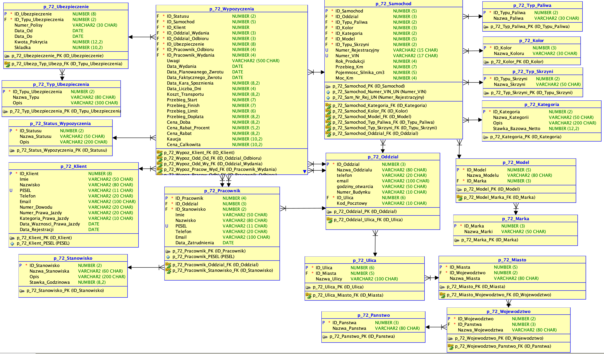

# Project ZTB

```bash
git clone https://github.com/kacperkaluza/ZTB.git
```

Canonical model
---------------
- [01-baza/sqlDeveloper/design.dmd](01-baza/sqlDeveloper/design.dmd)

Tool versions
-------------
- Oracle SQL Developer Data Modeler: 24.3.1.351
- Java runtime: 25.0.1 (2025-10-21 LTS)
- Git: 2.50.1 (Apple Git-155)

## Database Schema

