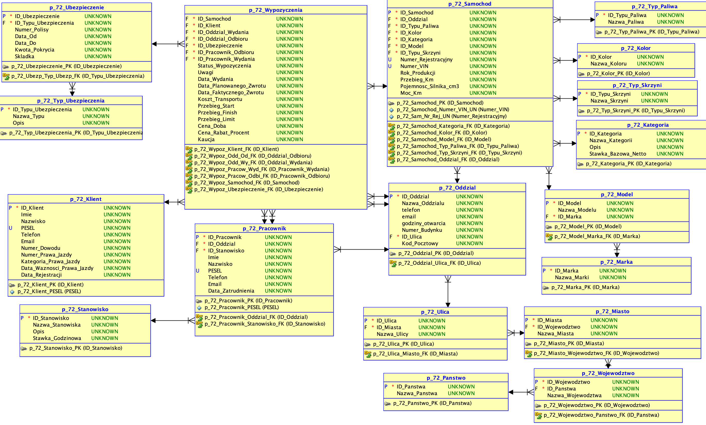

# Project ZTB

```bash
git clone https://github.com/kacperkaluza/ZTB.git
```

## Canonical model

- [01-baza/sqlDeveloper/design.dmd](01-baza/sqlDeveloper/design.dmd)

## Tool versions

- Oracle SQL Developer Data Modeler: 24.3.1.351
- Java runtime: 25.0.1 (2025-10-21 LTS)
- Git: 2.50.1 (Apple Git-155)

## Database Schema



## Oracle Docker Environment

Local Oracle Database Free 26ai can be started with Docker Compose.

### Prerequisites

- Docker Desktop with WSL2 enabled on Windows
- Access to Oracle Container Registry and accepted license terms for `container-registry.oracle.com/database/free`

### Start

```powershell
docker login container-registry.oracle.com
docker compose up -d --build
```

### Connection details

- Host: `localhost`
- Port: `1521`
- Service: `FREE` or `FREEPDB1`
- User: `system` or `pdbadmin`
- Password: `ZtbOracle123!`

### Persistence

Database files are stored in the named Docker volume `oracle_data`, so the data survives container recreation.
