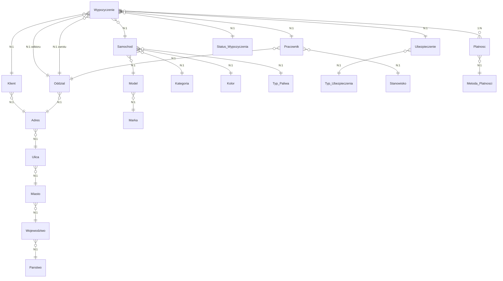

# Projekt Relacyjnej Bazy Danych — System Obsługi Wypożyczalni Samochodów

> [!NOTE]
> Środowisko docelowe: **Oracle Database (OLTP)**. Schemat znormalizowany do **3NF**.
> Nazewnictwo: język polski bez polskich znaków diakrytycznych.
> Łączna liczba tabel: **21**.

---

## Diagram Relacji (ERD — Uproszczony)

---

## Spis Tabel wg Gałęzi Logicznych

| # | Gałąź | Tabela | Rola |
|---|-------|--------|------|
| 1 | Transakcji | `Wypozyczenie` | **Centralna tabela faktów** |
| 2 | Transakcji | `Status_Wypozyczenia` | Słownik statusów wypożyczenia |
| 3 | Transakcji | `Ubezpieczenie` | Polisa ubezpieczeniowa |
| 4 | Transakcji | `Typ_Ubezpieczenia` | Słownik typów ubezpieczeń |
| 5 | Transakcji | `Platnosc` | Rejestr płatności |
| 6 | Transakcji | `Metoda_Platnosci` | Słownik metod płatności |
| 7 | Klienta i adresu | `Klient` | Dane klienta |
| 8 | Klienta i adresu | `Adres` | Pełny adres (łącznik) |
| 9 | Klienta i adresu | `Ulica` | Słownik ulic |
| 10 | Klienta i adresu | `Miasto` | Słownik miast |
| 11 | Klienta i adresu | `Wojewodztwo` | Słownik województw |
| 12 | Klienta i adresu | `Panstwo` | Słownik państw |
| 13 | Pojazdu | `Samochod` | Dane pojazdu |
| 14 | Pojazdu | `Model` | Słownik modeli |
| 15 | Pojazdu | `Marka` | Słownik marek |
| 16 | Pojazdu | `Kategoria` | Słownik kategorii pojazdów |
| 17 | Pojazdu | `Kolor` | Słownik kolorów |
| 18 | Pojazdu | `Typ_Paliwa` | Słownik typów paliwa |
| 19 | Pracownika i oddziału | `Pracownik` | Dane pracownika |
| 20 | Pracownika i oddziału | `Stanowisko` | Słownik stanowisk |
| 21 | Pracownika i oddziału | `Oddzial` | Dane oddziału wypożyczalni |

---

## I. Gałąź Transakcji

### 1. `Wypozyczenie` — Centralna Tabela Faktów

> [!IMPORTANT]
> Tabela centralna zawiera **12 miar liczbowych** (oznaczonych symbolem 📊), spełniając wymóg minimum 10.

| # | Kolumna | Rola | Typ danych | Opis |
|---|---------|------|------------|------|
| 1 | `id_wypozyczenia` | **PK** | `INTEGER` | Unikalny identyfikator wypożyczenia |
| 2 | `id_klienta` | **FK → Klient** | `INTEGER` | Klient wypożyczający |
| 3 | `id_samochodu` | **FK → Samochod** | `INTEGER` | Wypożyczany pojazd |
| 4 | `id_pracownika_wydania` | **FK → Pracownik** | `INTEGER` | Pracownik wydający pojazd |
| 5 | `id_pracownika_odbioru` | **FK → Pracownik** | `INTEGER` | Pracownik odbierający pojazd (NULL do momentu zwrotu) |
| 6 | `id_ubezpieczenia` | **FK → Ubezpieczenie** | `INTEGER` | Wykupiona polisa |
| 7 | `id_statusu` | **FK → Status_Wypozyczenia** | `INTEGER` | Aktualny status transakcji |
| 8 | `id_oddzialu_wydania` | **FK → Oddzial** | `INTEGER` | Oddział wydania pojazdu |
| 9 | `id_oddzialu_zwrotu` | **FK → Oddzial** | `INTEGER` | Oddział zwrotu pojazdu |
| 10 | `data_wydania` | — | `DATE` | Data i godzina wydania pojazdu |
| 11 | `data_planowanego_zwrotu` | — | `DATE` | Planowana data zwrotu |
| 12 | `data_faktycznego_zwrotu` | — | `DATE` | Faktyczna data zwrotu (NULL do momentu zwrotu) |
| 13 | 📊 `cena_netto_za_dzien` | — | `NUMERIC(10,2)` | Stawka dzienna netto [PLN] |
| 14 | 📊 `cena_brutto_za_dzien` | — | `NUMERIC(10,2)` | Stawka dzienna brutto [PLN] |
| 15 | 📊 `liczba_dni` | — | `NUMERIC(4,0)` | Planowana liczba dni wypożyczenia |
| 16 | 📊 `koszt_netto` | — | `NUMERIC(12,2)` | Łączny koszt netto transakcji [PLN] |
| 17 | 📊 `koszt_brutto` | — | `NUMERIC(12,2)` | Łączny koszt brutto transakcji [PLN] |
| 18 | 📊 `kaucja` | — | `NUMERIC(10,2)` | Wpłacona kaucja [PLN] |
| 19 | 📊 `rabat_procent` | — | `NUMERIC(5,2)` | Przyznany rabat [%] (np. 15.00 = 15%) |
| 20 | 📊 `rabat_kwota` | — | `NUMERIC(10,2)` | Wartość rabatu [PLN] |
| 21 | 📊 `dystans_km` | — | `NUMERIC(8,1)` | Przejechany dystans [km] (NULL do zwrotu) |
| 22 | 📊 `kara_za_opoznienie` | — | `NUMERIC(10,2)` | Kara za nieterminowy zwrot [PLN] |
| 23 | 📊 `koszt_ubezpieczenia` | — | `NUMERIC(10,2)` | Koszt polisy ubezpieczeniowej [PLN] |
| 24 | 📊 `koszt_paliwa` | — | `NUMERIC(10,2)` | Koszt uzupełnienia paliwa lub ładowania [PLN] |
| 25 | `uwagi` | — | `VARCHAR2(500)` | Uwagi dodatkowe do transakcji |

---

### 2. `Status_Wypozyczenia` — Słownik Statusów

| # | Kolumna | Rola | Typ danych | Opis |
|---|---------|------|------------|------|
| 1 | `id_statusu` | **PK** | `INTEGER` | Identyfikator statusu |
| 2 | `nazwa_statusu` | — | `VARCHAR2(50)` | Nazwa statusu (np. „Rezerwacja", „Wydany", „Zwrocony", „Anulowany") |
| 3 | `opis` | — | `VARCHAR2(200)` | Opis znaczenia statusu |

---

### 3. `Ubezpieczenie` — Polisy Ubezpieczeniowe

| # | Kolumna | Rola | Typ danych | Opis |
|---|---------|------|------------|------|
| 1 | `id_ubezpieczenia` | **PK** | `INTEGER` | Identyfikator polisy |
| 2 | `id_typu_ubezpieczenia` | **FK → Typ_Ubezpieczenia** | `INTEGER` | Typ ubezpieczenia |
| 3 | `numer_polisy` | — | `VARCHAR2(30)` | Numer polisy ubezpieczeniowej |
| 4 | `data_od` | — | `DATE` | Data rozpoczęcia ochrony |
| 5 | `data_do` | — | `DATE` | Data zakończenia ochrony |
| 6 | `kwota_pokrycia` | — | `NUMERIC(12,2)` | Maksymalna kwota pokrycia [PLN] |
| 7 | `skladka` | — | `NUMERIC(10,2)` | Wysokość składki [PLN] |

---

### 4. `Typ_Ubezpieczenia` — Słownik Typów Ubezpieczeń

| # | Kolumna | Rola | Typ danych | Opis |
|---|---------|------|------------|------|
| 1 | `id_typu_ubezpieczenia` | **PK** | `INTEGER` | Identyfikator typu |
| 2 | `nazwa_typu` | — | `VARCHAR2(80)` | Nazwa (np. „OC podstawowe", „AC pełne", „NNW", „Assistance 24h") |
| 3 | `opis` | — | `VARCHAR2(300)` | Szczegółowy opis zakresu ochrony |

---

### 5. `Platnosc` — Rejestr Płatności

> [!TIP]
> Relacja 1:N z `Wypozyczenie` umożliwia rejestrację płatności częściowych, rat oraz zwrotów kaucji.

| # | Kolumna | Rola | Typ danych | Opis |
|---|---------|------|------------|------|
| 1 | `id_platnosci` | **PK** | `INTEGER` | Identyfikator płatności |
| 2 | `id_wypozyczenia` | **FK → Wypozyczenie** | `INTEGER` | Powiązane wypożyczenie |
| 3 | `id_metody_platnosci` | **FK → Metoda_Platnosci** | `INTEGER` | Metoda płatności |
| 4 | `kwota` | — | `NUMERIC(12,2)` | Kwota płatności [PLN] |
| 5 | `data_platnosci` | — | `DATE` | Data i godzina zaksięgowania |
| 6 | `numer_transakcji` | — | `VARCHAR2(50)` | Numer referencyjny transakcji bankowej |
| 7 | `czy_zwrot` | — | `NUMERIC(1,0)` | Flaga: 1 = zwrot, 0 = wpłata |

---

### 6. `Metoda_Platnosci` — Słownik Metod Płatności

| # | Kolumna | Rola | Typ danych | Opis |
|---|---------|------|------------|------|
| 1 | `id_metody_platnosci` | **PK** | `INTEGER` | Identyfikator metody |
| 2 | `nazwa_metody` | — | `VARCHAR2(50)` | Nazwa (np. „Gotówka", „Karta debetowa", „Przelew", „BLIK") |

---

## II. Gałąź Klienta i Adresu

> [!NOTE]
> Hierarchia adresowa jest w pełni znormalizowana (3NF):
> **Panstwo → Wojewodztwo → Miasto → Ulica → Adres → Klient / Oddzial**

### 7. `Klient` — Dane Klienta

| # | Kolumna | Rola | Typ danych | Opis |
|---|---------|------|------------|------|
| 1 | `id_klienta` | **PK** | `INTEGER` | Identyfikator klienta |
| 2 | `id_adresu` | **FK → Adres** | `INTEGER` | Adres zamieszkania |
| 3 | `imie` | — | `VARCHAR2(50)` | Imię klienta |
| 4 | `nazwisko` | — | `VARCHAR2(80)` | Nazwisko klienta |
| 5 | `pesel` | — | `CHAR(11)` | Numer PESEL (unikalny) |
| 6 | `numer_dowodu` | — | `VARCHAR2(20)` | Numer dokumentu tożsamości |
| 7 | `numer_prawa_jazdy` | — | `VARCHAR2(20)` | Numer prawa jazdy |
| 8 | `kategoria_prawa_jazdy` | — | `VARCHAR2(10)` | Kategorie prawa jazdy (np. „B", „B+E") |
| 9 | `data_waznosci_prawa_jazdy` | — | `DATE` | Data ważności prawa jazdy |
| 10 | `telefon` | — | `VARCHAR2(20)` | Numer telefonu kontaktowego |
| 11 | `email` | — | `VARCHAR2(100)` | Adres e-mail |
| 12 | `data_rejestracji` | — | `DATE` | Data rejestracji klienta w systemie |

---

### 8. `Adres` — Pełny Adres (Tabela Łącznikowa)

| # | Kolumna | Rola | Typ danych | Opis |
|---|---------|------|------------|------|
| 1 | `id_adresu` | **PK** | `INTEGER` | Identyfikator adresu |
| 2 | `id_ulicy` | **FK → Ulica** | `INTEGER` | Ulica |
| 3 | `numer_budynku` | — | `VARCHAR2(10)` | Numer budynku (np. „12A") |
| 4 | `numer_lokalu` | — | `VARCHAR2(10)` | Numer lokalu (NULL jeśli dom) |
| 5 | `kod_pocztowy` | — | `CHAR(6)` | Kod pocztowy (format: „00-000") |

---

### 9. `Ulica` — Słownik Ulic

| # | Kolumna | Rola | Typ danych | Opis |
|---|---------|------|------------|------|
| 1 | `id_ulicy` | **PK** | `INTEGER` | Identyfikator ulicy |
| 2 | `id_miasta` | **FK → Miasto** | `INTEGER` | Miasto, do którego należy ulica |
| 3 | `nazwa_ulicy` | — | `VARCHAR2(100)` | Nazwa ulicy (np. „ul. Krakowska") |

---

### 10. `Miasto` — Słownik Miast

| # | Kolumna | Rola | Typ danych | Opis |
|---|---------|------|------------|------|
| 1 | `id_miasta` | **PK** | `INTEGER` | Identyfikator miasta |
| 2 | `id_wojewodztwa` | **FK → Wojewodztwo** | `INTEGER` | Województwo |
| 3 | `nazwa_miasta` | — | `VARCHAR2(80)` | Nazwa miasta |

---

### 11. `Wojewodztwo` — Słownik Województw

| # | Kolumna | Rola | Typ danych | Opis |
|---|---------|------|------------|------|
| 1 | `id_wojewodztwa` | **PK** | `INTEGER` | Identyfikator województwa |
| 2 | `id_panstwa` | **FK → Panstwo** | `INTEGER` | Państwo |
| 3 | `nazwa_wojewodztwa` | — | `VARCHAR2(80)` | Nazwa województwa / regionu |

---

### 12. `Panstwo` — Słownik Państw

| # | Kolumna | Rola | Typ danych | Opis |
|---|---------|------|------------|------|
| 1 | `id_panstwa` | **PK** | `INTEGER` | Identyfikator państwa |
| 2 | `nazwa_panstwa` | — | `VARCHAR2(80)` | Pełna nazwa państwa |
| 3 | `kod_iso` | — | `CHAR(3)` | Kod ISO 3166-1 alpha-3 (np. „POL", „DEU") |

---

## III. Gałąź Pojazdu

> [!NOTE]
> Dane pojazdu są znormalizowane do 3NF przez rozbicie na słowniki:
> **Marka → Model → Samochod**, plus osobne słowniki: **Kategoria**, **Kolor**, **Typ_Paliwa**.

### 13. `Samochod` — Dane Pojazdu

| # | Kolumna | Rola | Typ danych | Opis |
|---|---------|------|------------|------|
| 1 | `id_samochodu` | **PK** | `INTEGER` | Identyfikator pojazdu |
| 2 | `id_modelu` | **FK → Model** | `INTEGER` | Model pojazdu |
| 3 | `id_kategorii` | **FK → Kategoria** | `INTEGER` | Kategoria cenowa / segmentowa |
| 4 | `id_koloru` | **FK → Kolor** | `INTEGER` | Kolor nadwozia |
| 5 | `id_typu_paliwa` | **FK → Typ_Paliwa** | `INTEGER` | Rodzaj paliwa / napędu |
| 6 | `numer_rejestracyjny` | — | `VARCHAR2(15)` | Numer rejestracyjny (unikalny) |
| 7 | `numer_vin` | — | `CHAR(17)` | Numer VIN (unikalny, 17 znaków) |
| 8 | `rok_produkcji` | — | `NUMERIC(4,0)` | Rok produkcji |
| 9 | `przebieg_km` | — | `NUMERIC(8,0)` | Aktualny przebieg [km] |
| 10 | `liczba_miejsc` | — | `NUMERIC(2,0)` | Liczba miejsc pasażerskich |
| 11 | `pojemnosc_silnika_cm3` | — | `NUMERIC(5,0)` | Pojemność silnika [cm³] (0 dla EV) |
| 12 | `moc_km` | — | `NUMERIC(4,0)` | Moc silnika [KM] |
| 13 | `typ_skrzyni` | — | `VARCHAR2(20)` | Typ skrzyni biegów (np. „Manualna", „Automatyczna") |
| 14 | `data_ostatniego_przegladu` | — | `DATE` | Data ostatniego przeglądu technicznego |
| 15 | `czy_dostepny` | — | `NUMERIC(1,0)` | Flaga: 1 = dostępny, 0 = niedostępny |

---

### 14. `Model` — Słownik Modeli Pojazdów

| # | Kolumna | Rola | Typ danych | Opis |
|---|---------|------|------------|------|
| 1 | `id_modelu` | **PK** | `INTEGER` | Identyfikator modelu |
| 2 | `id_marki` | **FK → Marka** | `INTEGER` | Marka produkująca model |
| 3 | `nazwa_modelu` | — | `VARCHAR2(80)` | Nazwa modelu (np. „Corolla", „Golf", „Model 3") |

---

### 15. `Marka` — Słownik Marek

| # | Kolumna | Rola | Typ danych | Opis |
|---|---------|------|------------|------|
| 1 | `id_marki` | **PK** | `INTEGER` | Identyfikator marki |
| 2 | `nazwa_marki` | — | `VARCHAR2(50)` | Nazwa marki (np. „Toyota", „Volkswagen", „Tesla") |
| 3 | `kraj_pochodzenia` | — | `VARCHAR2(50)` | Kraj pochodzenia marki |

---

### 16. `Kategoria` — Słownik Kategorii Pojazdów

| # | Kolumna | Rola | Typ danych | Opis |
|---|---------|------|------------|------|
| 1 | `id_kategorii` | **PK** | `INTEGER` | Identyfikator kategorii |
| 2 | `nazwa_kategorii` | — | `VARCHAR2(50)` | Nazwa (np. „Ekonomiczny", „Komfort", „Premium", „SUV", „Van") |
| 3 | `opis` | — | `VARCHAR2(200)` | Opis segmentu i typowego przeznaczenia |
| 4 | `stawka_bazowa_netto` | — | `NUMERIC(10,2)` | Bazowa stawka dzienna netto dla kategorii [PLN] |

---

### 17. `Kolor` — Słownik Kolorów

| # | Kolumna | Rola | Typ danych | Opis |
|---|---------|------|------------|------|
| 1 | `id_koloru` | **PK** | `INTEGER` | Identyfikator koloru |
| 2 | `nazwa_koloru` | — | `VARCHAR2(30)` | Nazwa koloru (np. „Czarny metalic", „Biały perłowy") |

---

### 18. `Typ_Paliwa` — Słownik Typów Paliwa

| # | Kolumna | Rola | Typ danych | Opis |
|---|---------|------|------------|------|
| 1 | `id_typu_paliwa` | **PK** | `INTEGER` | Identyfikator typu paliwa |
| 2 | `nazwa_paliwa` | — | `VARCHAR2(30)` | Nazwa (np. „Benzyna", „Diesel", „LPG", „Elektryczny", „Hybryda") |

---

## IV. Gałąź Pracownika i Oddziału

### 19. `Pracownik` — Dane Pracownika

| # | Kolumna | Rola | Typ danych | Opis |
|---|---------|------|------------|------|
| 1 | `id_pracownika` | **PK** | `INTEGER` | Identyfikator pracownika |
| 2 | `id_stanowiska` | **FK → Stanowisko** | `INTEGER` | Stanowisko służbowe |
| 3 | `id_oddzialu` | **FK → Oddzial** | `INTEGER` | Oddział macierzysty |
| 4 | `imie` | — | `VARCHAR2(50)` | Imię pracownika |
| 5 | `nazwisko` | — | `VARCHAR2(80)` | Nazwisko pracownika |
| 6 | `pesel` | — | `CHAR(11)` | PESEL pracownika (unikalny) |
| 7 | `telefon` | — | `VARCHAR2(20)` | Telefon służbowy |
| 8 | `email` | — | `VARCHAR2(100)` | E-mail służbowy |
| 9 | `data_zatrudnienia` | — | `DATE` | Data zatrudnienia |
| 10 | `czy_aktywny` | — | `NUMERIC(1,0)` | Flaga: 1 = aktywny, 0 = nieaktywny |

---

### 20. `Stanowisko` — Słownik Stanowisk

| # | Kolumna | Rola | Typ danych | Opis |
|---|---------|------|------------|------|
| 1 | `id_stanowiska` | **PK** | `INTEGER` | Identyfikator stanowiska |
| 2 | `nazwa_stanowiska` | — | `VARCHAR2(60)` | Nazwa (np. „Kierownik oddziału", „Konsultant", „Mechanik") |
| 3 | `opis` | — | `VARCHAR2(200)` | Zakres obowiązków |
| 4 | `stawka_godzinowa` | — | `NUMERIC(8,2)` | Bazowa stawka godzinowa [PLN] |

---

### 21. `Oddzial` — Dane Oddziału Wypożyczalni

| # | Kolumna | Rola | Typ danych | Opis |
|---|---------|------|------------|------|
| 1 | `id_oddzialu` | **PK** | `INTEGER` | Identyfikator oddziału |
| 2 | `id_adresu` | **FK → Adres** | `INTEGER` | Adres fizyczny oddziału |
| 3 | `nazwa_oddzialu` | — | `VARCHAR2(80)` | Nazwa oddziału (np. „Warszawa Okęcie", „Kraków Główny") |
| 4 | `telefon` | — | `VARCHAR2(20)` | Telefon kontaktowy |
| 5 | `email` | — | `VARCHAR2(100)` | E-mail oddziału |
| 6 | `godziny_otwarcia` | — | `VARCHAR2(50)` | Godziny pracy (np. „Pon-Pt 8:00-18:00, Sob 9:00-14:00") |
| 7 | `czy_aktywny` | — | `NUMERIC(1,0)` | Flaga: 1 = aktywny, 0 = zamknięty |

---

## Podsumowanie Miar w Tabeli Centralnej `Wypozyczenie`

| # | Kolumna | Typ | Jednostka | Opis |
|---|---------|-----|-----------|------|
| 1 | `cena_netto_za_dzien` | `NUMERIC(10,2)` | PLN | Stawka dzienna netto |
| 2 | `cena_brutto_za_dzien` | `NUMERIC(10,2)` | PLN | Stawka dzienna brutto |
| 3 | `liczba_dni` | `NUMERIC(4,0)` | dni | Planowana długość wypożyczenia |
| 4 | `koszt_netto` | `NUMERIC(12,2)` | PLN | Łączny koszt netto |
| 5 | `koszt_brutto` | `NUMERIC(12,2)` | PLN | Łączny koszt brutto |
| 6 | `kaucja` | `NUMERIC(10,2)` | PLN | Kaucja zabezpieczająca |
| 7 | `rabat_procent` | `NUMERIC(5,2)` | % | Rabat procentowy |
| 8 | `rabat_kwota` | `NUMERIC(10,2)` | PLN | Rabat kwotowy |
| 9 | `dystans_km` | `NUMERIC(8,1)` | km | Przejechany dystans |
| 10 | `kara_za_opoznienie` | `NUMERIC(10,2)` | PLN | Kara za opóźniony zwrot |
| 11 | `koszt_ubezpieczenia` | `NUMERIC(10,2)` | PLN | Koszt ubezpieczenia |
| 12 | `koszt_paliwa` | `NUMERIC(10,2)` | PLN | Koszt uzupełnienia paliwa |

---

## Podsumowanie Relacji Kluczy Obcych

| Tabela źródłowa | Kolumna FK | Tabela docelowa | Kolumna PK | Kardynalność |
|------------------|-----------|-----------------|------------|--------------|
| `Wypozyczenie` | `id_klienta` | `Klient` | `id_klienta` | N : 1 |
| `Wypozyczenie` | `id_samochodu` | `Samochod` | `id_samochodu` | N : 1 |
| `Wypozyczenie` | `id_pracownika_wydania` | `Pracownik` | `id_pracownika` | N : 1 |
| `Wypozyczenie` | `id_pracownika_odbioru` | `Pracownik` | `id_pracownika` | N : 1 |
| `Wypozyczenie` | `id_ubezpieczenia` | `Ubezpieczenie` | `id_ubezpieczenia` | N : 1 |
| `Wypozyczenie` | `id_statusu` | `Status_Wypozyczenia` | `id_statusu` | N : 1 |
| `Wypozyczenie` | `id_oddzialu_wydania` | `Oddzial` | `id_oddzialu` | N : 1 |
| `Wypozyczenie` | `id_oddzialu_zwrotu` | `Oddzial` | `id_oddzialu` | N : 1 |
| `Platnosc` | `id_wypozyczenia` | `Wypozyczenie` | `id_wypozyczenia` | N : 1 |
| `Platnosc` | `id_metody_platnosci` | `Metoda_Platnosci` | `id_metody_platnosci` | N : 1 |
| `Ubezpieczenie` | `id_typu_ubezpieczenia` | `Typ_Ubezpieczenia` | `id_typu_ubezpieczenia` | N : 1 |
| `Klient` | `id_adresu` | `Adres` | `id_adresu` | N : 1 |
| `Adres` | `id_ulicy` | `Ulica` | `id_ulicy` | N : 1 |
| `Ulica` | `id_miasta` | `Miasto` | `id_miasta` | N : 1 |
| `Miasto` | `id_wojewodztwa` | `Wojewodztwo` | `id_wojewodztwa` | N : 1 |
| `Wojewodztwo` | `id_panstwa` | `Panstwo` | `id_panstwa` | N : 1 |
| `Samochod` | `id_modelu` | `Model` | `id_modelu` | N : 1 |
| `Samochod` | `id_kategorii` | `Kategoria` | `id_kategorii` | N : 1 |
| `Samochod` | `id_koloru` | `Kolor` | `id_koloru` | N : 1 |
| `Samochod` | `id_typu_paliwa` | `Typ_Paliwa` | `id_typu_paliwa` | N : 1 |
| `Model` | `id_marki` | `Marka` | `id_marki` | N : 1 |
| `Pracownik` | `id_stanowiska` | `Stanowisko` | `id_stanowiska` | N : 1 |
| `Pracownik` | `id_oddzialu` | `Oddzial` | `id_oddzialu` | N : 1 |
| `Oddzial` | `id_adresu` | `Adres` | `id_adresu` | N : 1 |

---

## Uwagi Projektowe

> [!TIP]
> **Konwencja nazewnicza:** Wszystkie nazwy tabel i kolumn są w języku polskim bez znaków diakrytycznych, w notacji `snake_case`. Klucze główne mają prefix `id_`, klucze obce powtarzają nazwę kolumny PK tabeli docelowej.

> [!WARNING]
> **Kolumny z flagami logicznymi** (`czy_dostepny`, `czy_aktywny`, `czy_zwrot`) są typu `NUMERIC(1,0)` zamiast `BOOLEAN`, ponieważ Oracle Database nie posiada natywnego typu `BOOLEAN` w wersjach starszych niż 23c. W Oracle 23c+ można zastąpić je typem `BOOLEAN`.

1. **Sekwencje Oracle:** Dla każdego klucza głównego (`INTEGER`) należy utworzyć sekwencję Oracle (`CREATE SEQUENCE`) i odpowiadający jej trigger `BEFORE INSERT` lub użyć kolumny `GENERATED ALWAYS AS IDENTITY` (Oracle 12c+).

2. **Ograniczenia `UNIQUE`:** Kolumny `pesel` (w tabelach `Klient` i `Pracownik`), `numer_rejestracyjny` i `numer_vin` (w tabeli `Samochod`) powinny mieć nałożone ograniczenia `UNIQUE`.

3. **Ograniczenia `CHECK`:** Zalecane walidacje:
   - `rabat_procent BETWEEN 0 AND 100`
   - `liczba_dni > 0`
   - `kaucja >= 0`
   - `dystans_km >= 0`
   - `czy_dostepny IN (0, 1)`, `czy_aktywny IN (0, 1)`, `czy_zwrot IN (0, 1)`

4. **Indeksy:** Oprócz automatycznych indeksów na PK i UNIQUE, zaleca się indeksy na kolumnach FK w tabeli `Wypozyczenie` oraz na `data_wydania` i `data_faktycznego_zwrotu` (częste filtrowanie raportowe).

5. **Typ `DATE` w Oracle:** Typ `DATE` w Oracle przechowuje zarówno datę, jak i czas z dokładnością do sekundy. Dla wyższej precyzji (np. logowanie) można użyć `TIMESTAMP`.
